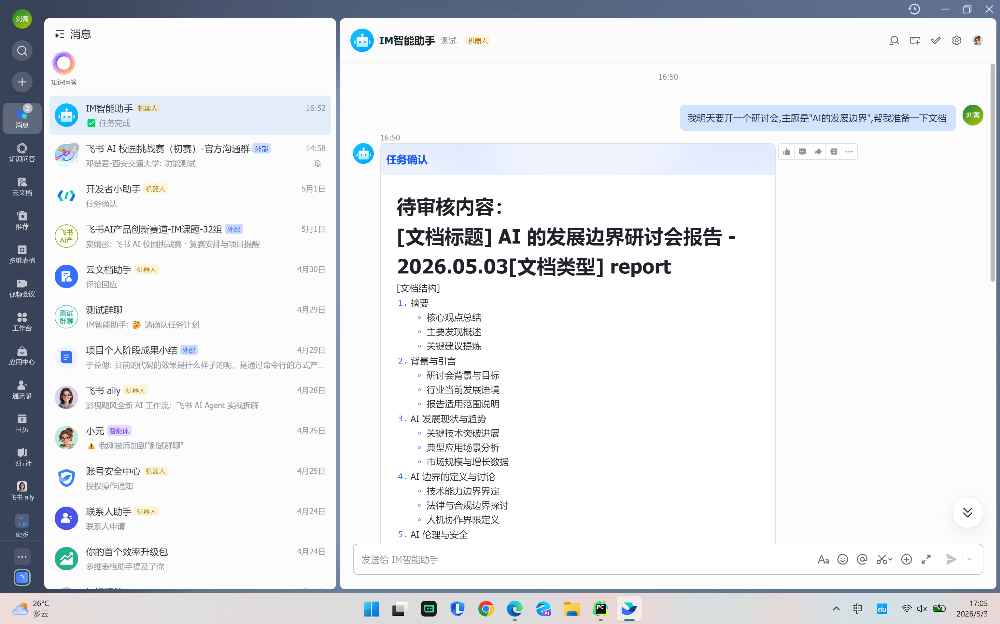
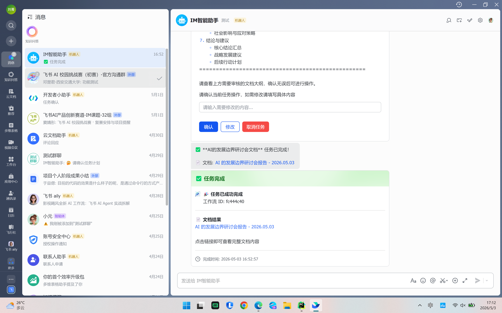
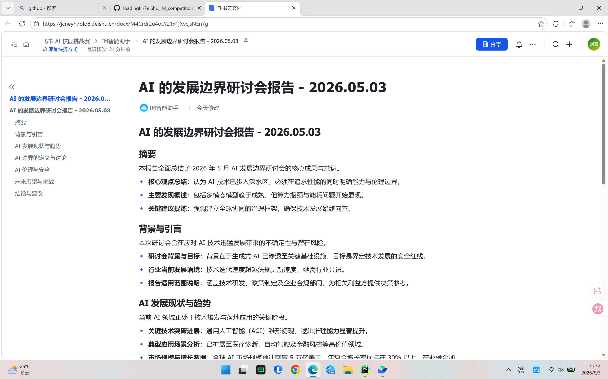

# FeiShu IM Competition (Agent-Pilot)

基于 **LangGraph + FastAPI + 飞书开放平台** 的多阶段 Agent 工作流。项目支持从自然语言输入自动完成任务规划，并输出飞书文档与 PPT 结果。

## 核心能力

- 意图识别 + 任务规划（Router -> Plan）
- 文档生成（写入飞书 Docx）
- PPT 生成（Node.js + PptxGenJS 生成 `.pptx`）
- 人工确认节点（确认 / 修改 / 取消）
- WebSocket 实时事件推送
- 飞书机器人双入口（Webhook、长连接）

## 技术栈

- **后端**：FastAPI、LangGraph、LangChain
- **模型接入**：OpenAI 兼容接口（当前通过 Qwen 参数接入）
- **飞书集成**：消息收发、卡片交互、Docx 写入、群聊历史读取
- **PPT 生成**：Node.js + `pptxgenjs`

## 项目结构

```text
app/
  main.py                     # FastAPI 入口、/ws、生命周期管理
  router/
    workflows.py              # 工作流 REST API
    feishu_bot.py             # 飞书 webhook 入口
  service/
    workflow.py               # WorkflowManager：创建/执行/确认/取消
    websocket.py              # WebSocket 广播协议
    confirmation.py           # 确认阻塞与唤醒
    chat.py                   # 聊天消息输入管理
    feishu_ws_manager.py      # 飞书长连接管理
    feishu_message_service.py # 飞书通知与卡片发送
  crud/workflow.py            # 内存态工作流存储
  model/__init__.py           # WorkflowStatus / WorkflowInstance
  schema/__init__.py          # API 请求响应模型

core_workflow/
  graph/graph.py              # LangGraph 拓扑与分支路由
  state/state.py              # IMState 全局状态定义
  nodes/                      # Router/Plan/Confirm/Doc/PPT/Delivery 节点
```

## 工作流主路径

1. `RouterNode`：识别意图并补充上下文
2. `PlanNode`：生成任务计划（文档 / PPT / 两者）
3. `ConfirmNode`：等待用户确认、修改或取消
4. `TextGenerateNode`：生成文档大纲与内容并写入飞书 Docx
5. `PPTGenerateNode`：生成大纲与内容并产出 `.pptx`
6. `MultiTerminalNode` + `DeliveryNode`：汇总结果并向前端/飞书推送

## 快速开始

> 建议在仓库根目录执行命令（项目内部分路径依赖当前工作目录）。

### 1. 安装 Python 依赖

```powershell
pip install -r requirements.txt
```

### 2. 安装 Node.js 依赖（PPT 生成必需）

```powershell
Set-Location core_workflow
npm install
Set-Location ..
```

### 3. 配置环境变量

在仓库根目录创建 `.env`（或补充已有 `.env`）：

```env
# LLM
QWEN_KEY=your_api_key
QWEN_MODEL=your_model_name
QWEN_URL=https://your-openai-compatible-endpoint/v1
ROUTER_MODEL=your_router_model

# 飞书应用（消息、文档、长连接）
FEISHU_APP_ID=cli_xxx
FEISHU_APP_SECRET=xxx

# 可选：Webhook 验签
FEISHU_ENCRYPT_KEY=
FEISHU_VERIFICATION_TOKEN=
```

### 4. 启动服务

```powershell
uvicorn app.main:app --host 0.0.0.0 --port 8000 --reload
```

- 健康检查：`GET /health`
- Swagger 文档：`http://127.0.0.1:8000/docs`

## API 概览

### 工作流接口（`/workflows`）

| Method | Path | 说明 |
| --- | --- | --- |
| POST | `/workflows` | 创建并启动工作流 |
| GET | `/workflows/{workflow_id}` | 查询工作流状态 |
| POST | `/workflows/{workflow_id}/confirm` | 提交确认/修改/取消 |
| POST | `/workflows/{workflow_id}/chat` | 向运行中工作流发送消息 |
| POST | `/workflows/{workflow_id}/cancel` | 强制取消工作流 |
| GET | `/workflows` | 查询最近工作流列表 |

创建工作流示例：

```bash
curl -X POST "http://127.0.0.1:8000/workflows" \
  -H "Content-Type: application/json" \
  -d "{\"user_input\":\"请生成一份AI行业研究报告并配套PPT\"}"
```

### 飞书接口（`/feishu-bot`）

| Method | Path | 说明 |
| --- | --- | --- |
| POST | `/feishu-bot/webhook` | 飞书事件订阅回调 |
| POST | `/feishu-bot/send-message` | 主动向飞书会话发消息 |

### WebSocket（`/ws`）

客户端上行消息：

- `{"type":"ping"}`
- `{"type":"subscribe","workflowId":"..."}`
- `{"type":"unsubscribe","workflowId":"..."}`

服务端典型下行事件：

- `workflow_created`
- `scene_started` / `scene_completed` / `scene_failed`
- `confirm_required` / `confirm_result`
- `chat_message`
- `workflow_completed` / `workflow_failed` / `workflow_cancelled`

## 当前限制与注意事项

- 工作流状态存储在内存中（`app/crud/workflow.py`），服务重启后不会保留历史。
- 文档生成依赖飞书 Docx 接口，未配置飞书凭证时相关流程不可用。
- 实际服务入口是 `app/main.py`，`core_workflow/main.py` 更偏向调试用途。

## 相关文档

- `core_workflow/feishu_md/design/Agent-Pilot-Workflow-Design.md`
- `core_workflow/feishu_md/FEISHU_INTEGRATION_README.md`
- `core_workflow/feishu_md/FEISHU_WS_README.md`

## 在飞书中的使用
发送需求,生成工作流

确认文档大纲

生成最终文档
